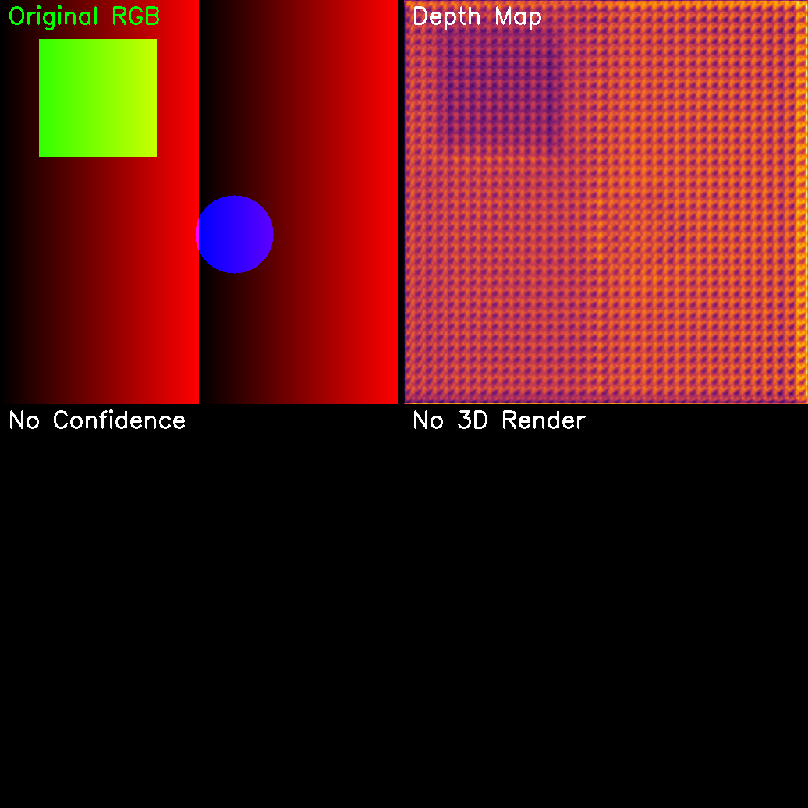

# Verification Report

## Visual Inspection


## Data Metrics
```json
{
    "depth_min": 0.8986591100692749,
    "depth_max": 0.9262088537216187,
    "depth_mean": 0.9132818579673767,
    "depth_std": 0.002942724386230111,
    "edge_sharpness_mean": 0.008854936651386322,
    "confidence_mean": null,
    "sky_region_mean": 0.9132723212242126,
    "sky_region_std": 0.003277209121733904
}
```

## Agent Assessment Instructions
1.  **Visual Check**: Look at the "Composite View".
    *   **Sky**: Is the sky region flat (bad) or infinite/far (good)?
    *   **Edges**: Are object boundaries sharp in the Depth Map?
    *   **Confidence**: Does the Confidence Map align with difficult areas (edges, transparent objects)?
2.  **Data Check**: Review the JSON metrics.
    *   `high_confidence_ratio`: Should be high (> 0.8) for good quality.
    *   `edge_sharpness_mean`: Higher is generally better.
3.  **Conclusion**: Based on the above, determine if the depth estimation is satisfactory.
